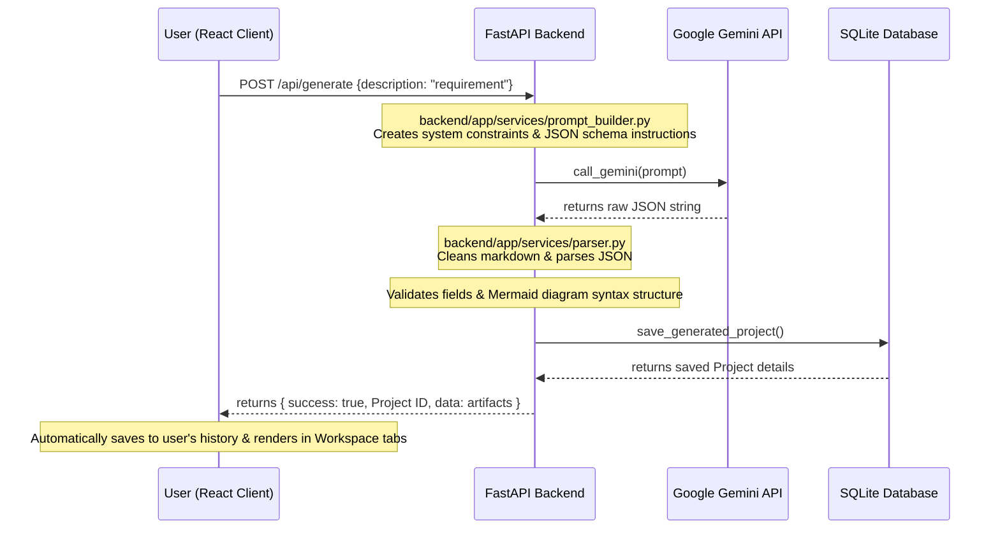

# SE Assistant (DesignDoc) - Project Understanding

This document provides a comprehensive overview of the **SE Assistant / SDE AI Tool** (internally named **DesignDoc**), its structure, key features, technology stack, and flow of operations.

---

## 📖 Project Overview

**SE Assistant (DesignDoc)** is an AI-powered Software Development Engineering helper. It allows users to input natural language software requirements (e.g., "Build an e-commerce platform with products and cart functionality") and automatically generates:
1. **SRS (Software Requirement Specification)**: Purpose, scope, user classes, functional/non-functional requirements, and constraints in a structured JSON.
2. **Mermaid Diagrams**:
   - **ERD (Entity Relationship Diagram)**
   - **Class Diagram**
   - **Sequence Diagram**
3. **SQL Schema**: Production-ready database schema definition.

The app supports saving multiple projects, managing user accounts, generating secure public sharing links, and includes a full administrator dashboard for system stats and user management.

---

## 📁 Project Directory Structure

Here is the key layout of the codebase:

```text
SysDesign-AI/
│
├── understand.md                 ← This explanation document
├── README.md                     ← User setup and installation guide
│
├── 📂 backend/                   ← FastAPI Python Backend Application
│   ├── main.py                   ← Backend server entry point (uvicorn on port 8000)
│   ├── requirements.txt          ← Python dependencies (FastAPI, SQLAlchemy, google-generativeai, etc.)
│   ├── designdoc.db              ← SQLite Database
│   ├── api_documentation.md      ← Detailed REST API Specification
│   │
│   └── 📂 app/
│       ├── 📂 core/
│       │   ├── config.py         ← Pydantic configuration settings (.env parser)
│       │   ├── database.py       ← SQLite/SQLAlchemy database connection setup
│       │   ├── dependencies.py   ← JWT Authentication & role protection dependencies
│       │   └── security.py       ← Bcrypt password hashing & JWT generation
│       │
│       ├── 📂 db_models/
│       │   ├── user.py           ← User & RefreshToken SQLAlchemy models
│       │   ├── project.py        ← Project & GeneratedArtifact models
│       │   └── shared_link.py    ← SharedLink model for public sharing URLs
│       │
│       ├── 📂 routes/
│       │   ├── auth.py           ← /api/auth (Login, Register, Logout, Profile, Refresh)
│       │   ├── generate.py       ← /api/generate (FastAPI endpoint that triggers Gemini model)
│       │   ├── projects.py       ← /api/projects (CRUD actions for user projects)
│       │   ├── sharing.py        ← /api/projects/{id}/share (Sharing link handlers)
│       │   └── admin.py          ← /api/admin (Protected routes for admin panels)
│       │
│       └── 📂 services/
│           ├── auth_service.py   ← User database registry and auth tokens logic
│           ├── gemini.py         ← Google Gemini 2.5 Flash API connector
│           ├── parser.py         ← Parses string output from AI to JSON format
│           ├── prompt_builder.py ← Builds system prompts with JSON templates
│           ├── project_service.py← Project CRUD operations helper
│           ├── sharing_service.py← Handles public token security & atomic view count increases
│           └── admin_service.py  ← Queries for overall app metrics, users, & active sessions
│
└── 📂 frontend/                  ← React.js Single Page Application
    ├── package.json              ← Frontend packages (React 19, Mermaid, etc.)
    │
    └── 📂 src/
        ├── App.js                ← Root react view (UI state machine, tab states, panels resizing)
        ├── App.css               ← Main stylesheet supporting dark/light mode and dynamic accent colors
        ├── config.js             ← API endpoint base configuration
        │
        ├── 📂 utils/
        │   ├── clipboard.js      ← Helper to copy raw code (SQL, Mermaid code) to clipboard
        │   └── pdfExport.js      ← Exports current SRS or whole workspace contents to PDF format
        │
        └── 📂 components/
            ├── Auth.js           ← Login / Registration page split with branding panels
            ├── Sidebar.js        ← Sidebar with project selection, workspace creation, theme and accent color controls
            ├── SRSView.js        ← Renders generated SRS details in organized layout
            ├── SQLView.js        ← Displays SQL database script with a quick copy button
            ├── DiagramView.js    ← Renders ERD/Class/Sequence diagrams with panning, zooming, and downloading (PNG/JPEG/SVG)
            ├── ShareModal.js     ← Shows project share link configuration
            ├── ShareViewer.js    ← Public access portal for shared links (Read-only)
            └── AdminPanel.js     ← Renders admin dashboards, total users, analytics, and project statistics
```

---

## 🛠 Tech Stack Details

### Backend
- **FastAPI**: Modern, high-performance web framework for Python APIs.
- **SQLAlchemy ORM**: Used to interface with the SQLite local database.
- **Google Gemini API**: Configured with `gemini-2.5-flash` using custom JSON formatting mode (`response_mime_type="application/json"`).
- **JWT (JSON Web Token)**: Standard authentication utilizing access and refresh tokens. HTTP-only cookies are used to prevent CSRF/XSS.
- **Alembic**: Database migrations management.

### Frontend
- **React.js (v19)**: Built with standard React elements.
- **Mermaid.js**: Dynamically compiles text strings (e.g., `erDiagram`, `classDiagram`) into renderable SVG graphics.
- **Vanilla CSS3**: Tailored layout supporting dark/light mode themes and custom color accents (blue, green, purple, orange, pink).
- **React PDF Export**: Converts HTML tables, text, and SVG views directly to printer/PDF format.

---

## 🔄 How the AI Generation Flow Works



---

## ✨ Features to Highlight

1. **Integrated Workspace**: The React interface is split into a collapsible/resizable double-panel layout (Chat input on the left, interactive tabs for SRS, ERD, Class Diagram, Sequence Diagram, and SQL on the right).
2. **Interactive Diagrams**: You can zoom in/out of Mermaid diagrams via controls or pinch/mousewheel gestures, drag/pan the diagram across the screen, and download the diagram directly as a **PNG**, **JPEG**, or **SVG** image.
3. **Advanced Theme Customization**: Users can toggle between **Dark/Light modes** and pick an **Accent color** (Blue, Green, Purple, Orange, Pink) which changes the active borders, buttons, and visual highlights.
4. **Public Share Links**: Users can generate a cryptographically secure token that creates a public URL (e.g., `/share/<token>`). Anonymous users can access a read-only snapshot of the project artifacts. If the admin deactivates a user, all their public links are instantly blocked.
5. **System Statistics & Admin Controls**: Users with the `admin` role can access a special dashboard showing:
   - System usage (active users, total projects, total artifacts created).
   - Metrics (generations today, generations this week, new users this week).
   - User account status manipulation (deactivate users, grant/revoke admin rights, or delete accounts).
6. **Robust Logging System**: Standard logging is configured to log HTTP methods, paths, statuses, and processing durations. For unhandled exceptions, full tracebacks are safely written to `backend/app.log` locally without leaking user passwords, helping developers quickly debug any bugs.
7. **Flexible Execution Path**: Automatic path resolution (`sys.path`) in `backend/main.py` prevents `ModuleNotFoundError` when launching the backend server directly from the `backend/` directory or the parent directory.

